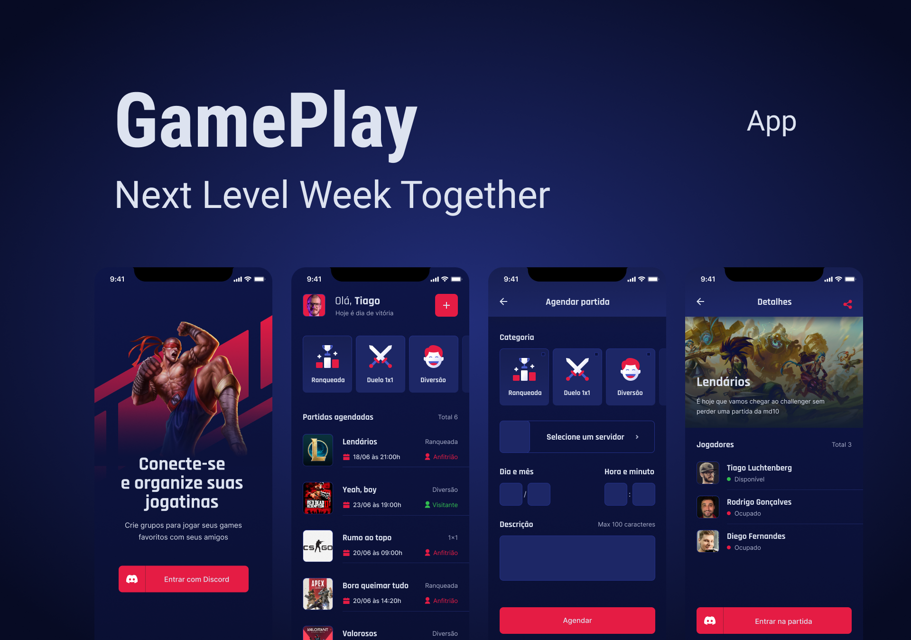

<h1 align="center">
  
</h1>

<p align="center">
  <a href="#-gameplay">Sobre</a>&nbsp;&nbsp;&nbsp;|&nbsp;&nbsp;&nbsp;
  <a href="#-tecnologias">Tecnologias</a>&nbsp;&nbsp;&nbsp;
</p>

<p align="center">
  
</p>

# 🎮 Gameplay

# ⚛ Tecnologias

Durante o desenvolvimento do projeto as principais tecnologias usadas foram:

- [Expo](https://expo.io/)
- [React Native](https://reactnative.dev/)
- [TypeScript](https://www.typescriptlang.org/)

<!---
# 🚀 Como testar

## Configurando ambiente 

### Expo

Após instalarmos o NodeJs, precisaremos instalar também o [Expo](https://expo.io/), na [documentação](https://docs.expo.io/) deles você pode encontrar todo um tutorial de instalação e configuração em cada ambiente e sistema operacional. Porém basicamente tudo se resume no seguinte comando que deve ser executado em seu terminal: 
```
$ npm install --global expo-cli
```

Depois de instalado você deve instalar o aplicativo Expo Go, disponível em sua loja de aplicativos, é através dele que você poderá executar o app em seu dispositivo físico, mas caso queira gerar uma apk ou um bundle e largar mão do Expo isso também é possível ( e recomendado ) e está disponível o passo a passo na documentação do Expo.

## Mão na massa

Pronto, agora com tudo instalado chegou finalmente a hora de começar, e a primeira coisa que você deve fazer é fazer um clone desse repositório para sua máquina local. Existem diversas formas de você fazer isso, mas a mais simples dela é baixar um arquivo zip do repositório e descompactá-lo em sua máquina.

Depois de descompactado, você deve navegar até a pasta raiz do seu projeto, pasta essa que conta com um arquivo chamado ```package.json```. Após encontrá-lo execute os seguinte comando: 

```
$ npm install
```

É importante que o comando seja executado dentro do diretório onde o ```package.json``` se encontra, pois é através dele que será instaladas todas as dependências do projeto.
 
-->
